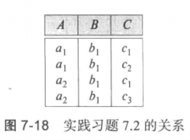
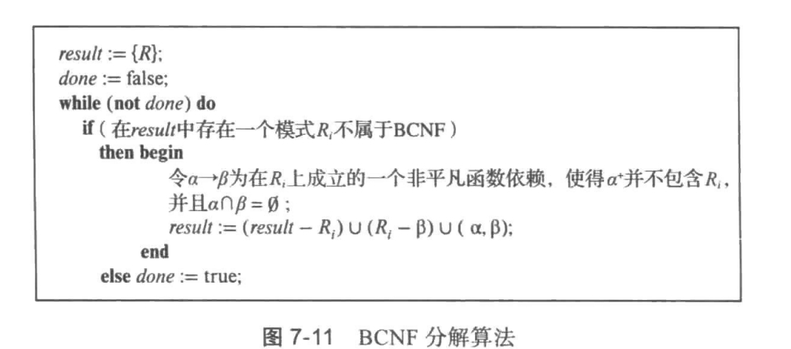
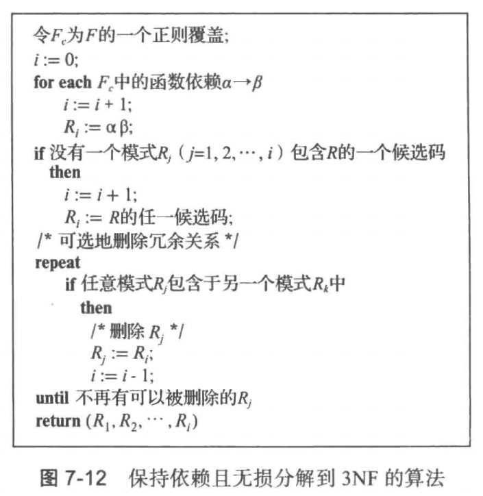

# 数据库 - 课后作业3

> 曹烨 软23 2021012167
>
> 1. 课本第353页 7.2题
>2. 课本第354页 7.6题
> 3. 课本第357页 7.21题
>4. 课本第357页 7.22题

[toc]

## 7.2 题

请列出图 7-18 的关系所满足的所有非平凡函数依赖。



---

根据图7-18所示的关系实例，我们可以通过分析关系中的元组来确定所有非平凡函数依赖：

1. 首先，我们可以观察到的非平凡函数依赖有：
	- $A \rightarrow B$（因为任意相同的A值都对应相同的B值）
	- $C \rightarrow B$（因为任意相同的C值都对应相同的B值）
	- $AC \rightarrow B$（这是由上述两个依赖逻辑蕴含的）
2. 通过反例可以证明不存在其他非平凡函数依赖：
	- $C \not\rightarrow A$：因为当$C=c_1$时，对应的$A$值有$a_1$和$a_2$
	- $B \not\rightarrow A$：因为当$B=b_1$时，对应的$A$值有$a_1$和$a_2$
	- $A \not\rightarrow C$：因为当$A=a_1$时，对应的$C$值有$c_1$和$c_2$
	- $B \not\rightarrow C$：因为当$B=b_1$时，对应的$C$值有$c_1$，$c_2$和$c_3$
3. 此外，还存在19个平凡函数依赖，形式为$\alpha \rightarrow \beta$，其中$\beta \subseteq \alpha$。这些平凡依赖包括：
	- 单属性到自身：$A \rightarrow A$, $B \rightarrow B$, $C \rightarrow C$
	- 双属性到其子集：$AB \rightarrow A$, $AB \rightarrow B$, $AB \rightarrow AB$等
	- 三属性到其子集：$ABC \rightarrow A$, $ABC \rightarrow B$, $ABC \rightarrow C$, $ABC \rightarrow AB$等

因此，这个关系的==所有非平凡函数依赖是：$A \rightarrow B$，$C \rightarrow B$和$AC \rightarrow B$==。

---

## 7.6题

请对于关系模式 $R=(A, B, C, D, E)$ 计算如下函数依赖集 $F$ 的闭包。

$$
\begin{aligned}
& A \rightarrow B C \\
& C D \rightarrow E \\
& B \rightarrow D \\
& E \rightarrow A
\end{aligned}
$$

---

1. 从 $A \rightarrow BC$ 开始推导：
	- 由分解律得：$A \rightarrow B$ 和 $A \rightarrow C$
	- 由 $A \rightarrow B$ 和 $B \rightarrow D$ 经传递律得：$A \rightarrow D$
	- 由 $A \rightarrow C$ 和 $A \rightarrow D$ 经合并律得：$A \rightarrow CD$
	- 由 $A \rightarrow CD$ 和 $CD \rightarrow E$ 经传递律得：$A \rightarrow E$
	- 综上可得：$A \rightarrow ABCDE$
2. 继续推导：
	- 由 $E \rightarrow A$ 和 $A \rightarrow ABCDE$ 经传递律得：$E \rightarrow ABCDE$
	- 由 $CD \rightarrow E$ 和 $E \rightarrow ABCDE$ 经传递律得：$CD \rightarrow ABCDE$
	- 由 $B \rightarrow D$ 可知 $BC \rightarrow CD$，进而得：$BC \rightarrow ABCDE$

让 $*$ 表示 $R$ 中的任意属性集，$\alpha$ 表示 ${A,B,C,D,E}$ 的任意子集，则 ==$F^+$ 包含==：

- 所有形如 $A* \rightarrow \alpha$, $BC* \rightarrow \alpha$, $CD* \rightarrow \alpha$, $E* \rightarrow \alpha$ 的函数依赖
- 原始函数依赖：$B \rightarrow D$
- 平凡函数依赖：如 $B \rightarrow B$, $C \rightarrow C$, $D \rightarrow D$ 等

---

## 7.21题

请给出实践习题 7.1 中模式`R=(A,B,C,D,E)`的一个无损的 BCNF 分解

$\begin{aligned} & A \rightarrow B C \\ & C D \rightarrow E \\ & B \rightarrow D \\ & E \rightarrow A\end{aligned}$

---

课本中BCNF分解算法如下：



1. 初始状态：R(A,B,C,D,E)
2. 按照图7-11的算法：
	- 发现B→D违反BCNF（因为B不是候选键）
	- 这是一个非平凡函数依赖，且B∩D=∅
	- 所以可以按照B→D进行分解：
		- R1 = (R - D) = (A,B,C,E)
		- R2 = (B,D)
3. 检查分解后的结果：
	- R1(A,B,C,E)满足BCNF
	- R2(B,D)满足BCNF

所以最终分解结果是：{(A,B,C,E), (B,D)}

---

## 7.22题

请给出实践习题 7.1 中模式`R=(A,B,C,D,E)`的一个无损并保持依赖的 3NF 分解

$\begin{aligned} & A \rightarrow B C \\ & C D \rightarrow E \\ & B \rightarrow D \\ & E \rightarrow A\end{aligned}$

---

课本中3NF分解算法如下：



1. **计算最小依赖集**

对原函数依赖集进行简化，得到最小依赖集：

```
A → B
A → C
CD → E
B → D
E → A
```

2. **按算法构造3NF分解**

1. 根据最小依赖集中的每个函数依赖形成关系模式：
	- R1(A,B) 来自 A → B
	- R2(A,C) 来自 A → C
	- R3(C,D,E) 来自 CD → E
	- R4(B,D) 来自 B → D
	- R5(E,A) 来自 E → A
2. 候选键检查：
	- 原关系的候选键为：A、BC、CD、E
	- 这些候选键都已包含在上述关系模式中
	- 无需添加额外的关系模式
3. 冗余关系检查：无冗余关系，不用删

综上所示，3NF分解结果为：

```
R1(A,B)
R2(A,C)
R3(C,D,E)
R4(B,D)
R5(E,A)
```

该分解满足无损连接性质且保持了所有函数依赖。
